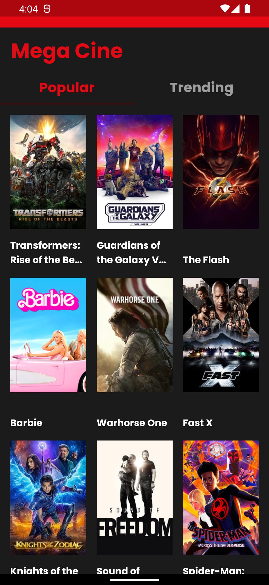
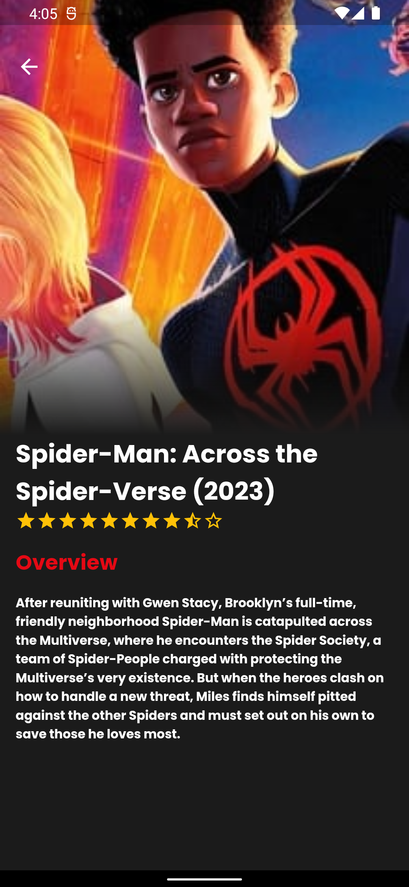
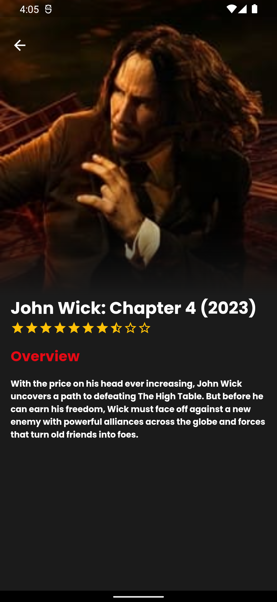

# 🎥 Movie App
## Sobre o projeto

Aplicativo para exibir filmes através da API [The Movie Database](https://www.themoviedb.org/documentation/api?language=pt-BR) (conhecida como TMDB). 
 Nesse projeto é possível obter uma lista dos filmes populares atuais no TMDB, informações primárias sobre cada filme e, 
uma lista de tendências diárias. 

## Layout 

### Tecnologias utilizadas

* Flutter
* API - The Movie Database (TMDB)
* Bloc

### Desenvolvedora

<a href="https://www.linkedin.com/in/jusy-lopes/" > 
